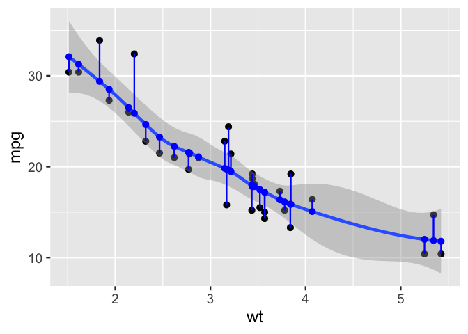
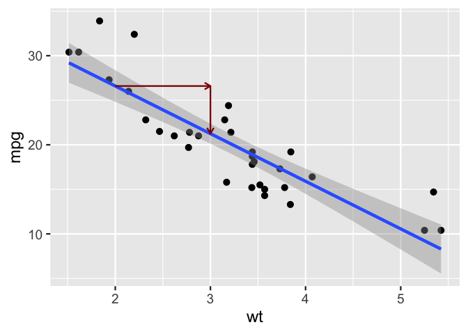

  - [ggsmoothfit](#ggsmoothfit)
  - [intercept](#intercept)
  - [Curious about implementation? Details about building these
    functions](#curious-about-implementation-details-about-building-these-functions)
  - [Step 00. Create alias of stat\_smooth(geom = “point”, xseq =
    ?)](#step-00-create-alias-of-stat_smoothgeom--point-xseq--)
      - [test it out…](#test-it-out)
  - [Step 0. Examine ggplot2::StatSmooth$compute\_group, and a dataframe
    that it
    returns](#step-0-examine-ggplot2statsmoothcompute_group-and-a-dataframe-that-it-returns)
  - [Step 1. create
    compute\_group\_smooth\_fit](#step-1-create-compute_group_smooth_fit)
  - [Step 1.1 test compute group](#step-11-test-compute-group)
  - [Step 2. Pass to ggproto](#step-2-pass-to-ggproto)
  - [Step 3. Pass to stat\_\*/ geom\_
    functions](#step-3-pass-to-stat_-geom_-functions)
  - [Step 4. Test in ggplot2 pipeline and
    enjoy\!](#step-4-test-in-ggplot2-pipeline-and-enjoy)
      - [Squared residuals](#squared-residuals)
  - [Test with lm](#test-with-lm)
  - [Contrast to an empty model…](#contrast-to-an-empty-model)
  - [Step 4.b Create geom alliases and wrappers, try it out, and enjoy\!
    Wait not working, how do I need to do
    this?](#step-4b-create-geom-alliases-and-wrappers-try-it-out-and-enjoy-wait-not-working-how-do-i-need-to-do-this)
  - [Don’t want to use ggsmoothfit? Here are some ways to get it done
    with base
    ggplot2\!](#dont-want-to-use-ggsmoothfit-here-are-some-ways-to-get-it-done-with-base-ggplot2)
      - [Option 1. Verbal description and move
        on…](#option-1-verbal-description-and-move-on)
      - [Option 2: precalculate and
        plot](#option-2-precalculate-and-plot)
      - [Option 3: little known xseq argument and geom =
        “point”](#option-3-little-known-xseq-argument-and-geom--point)
  - [Rise over run viz bonus…](#rise-over-run-viz-bonus)
  - [Part 2. Packaging and documentation 🚧
    ✅](#part-2-packaging-and-documentation--)
      - [minimal requirements for github package. Have
        you:](#minimal-requirements-for-github-package-have-you)
          - [Created files for package archetecture with
            `devtools::create("./ggbarlabs")`
            ✅](#created-files-for-package-archetecture-with-devtoolscreateggbarlabs-)
          - [Moved functions R folder? ✅](#moved-functions-r-folder-)
          - [Added roxygen skeleton? ✅](#added-roxygen-skeleton-)
          - [Managed dependencies ? ✅](#managed-dependencies--)
          - [Chosen a license? ✅](#chosen-a-license-)
          - [Run `devtools::check()` and addressed errors?
            ✅](#run-devtoolscheck-and-addressed-errors-)
      - [Listen 🚧](#listen-)
          - [Consulted with technical experts
            🚧](#consulted-with-technical-experts-)
          - [Consulted with potential users
            🚧](#consulted-with-potential-users-)
      - [Polish. Have you.](#polish-have-you)
          - [Settled on examples and put them in the roxygen skeleton?
            🚧](#settled-on-examples-and-put-them-in-the-roxygen-skeleton-)
          - [Written formal tests of functions?
            🚧](#written-formal-tests-of-functions-)
          - [Sent tests in this readme to package via readme2pkg
            🚧](#sent-tests-in-this-readme-to-package-via-readme2pkg-)
          - [Have you worked added a description and author information
            in the DESCRIPTION file?
            🚧](#have-you-worked-added-a-description-and-author-information-in-the-description-file-)
          - [Addressed *all* notes, warnings and errors.
            🚧](#addressed-all-notes-warnings-and-errors-)
      - [Promote](#promote)
          - [Package website built? 🚧](#package-website-built-)
          - [Package website deployed? 🚧](#package-website-deployed-)
      - [Harden](#harden)
          - [Submit to CRAN? 🚧](#submit-to-cran-)
  - [Reports, Environment](#reports-environment)
      - [Description file extract](#description-file-extract)
      - [Environment](#environment)
      - [`devtools::check()` report](#devtoolscheck-report)

<!-- README.md is generated from README.Rmd. Please edit that file -->

# ggsmoothfit

<!-- badges: start -->

<!-- badges: end -->

{ggsmoothfit} lets you visualize model fitted values and residuals
easily\!

``` r
library(tidyverse, warn.conflicts = F)
library(ggsmoothfit)
mtcars %>% 
  ggplot() + 
  aes(wt, mpg) +
  geom_point() +
  geom_smooth() +
  ggsmoothfit:::geom_fit() + 
  ggsmoothfit:::geom_residuals() 
#> `geom_smooth()` using method = 'loess' and formula = 'y ~ x'
#> `geom_smooth()` using method = 'loess' and formula = 'y ~ x'
#> `geom_smooth()` using method = 'loess' and formula = 'y ~ x'
```

<!-- -->

``` r
mtcars %>% 
  ggplot() + 
  aes(wt, mpg) +
  geom_point() +
  geom_smooth() + 
  ggsmoothfit:::geom_smooth_predict(xseq = 2:3, size = 5)
#> `geom_smooth()` using method = 'loess' and formula = 'y ~ x'
#> `geom_smooth()` using method = 'loess' and formula = 'y ~ x'
```

<!-- -->

``` r

last_plot() + 
  ggsmoothfit:::geom_smooth_step(xseq = 2:3) +
  NULL
#> `geom_smooth()` using method = 'loess' and formula = 'y ~ x'
#> `geom_smooth()` using method = 'loess' and formula = 'y ~ x'
#> `geom_smooth()` using method = 'loess'
```

<!-- -->

# intercept

``` r
mtcars %>% 
  ggplot() + 
  aes(wt, mpg) +
  geom_point() +
  geom_smooth(method = lm) + 
  ggsmoothfit:::geom_smooth_predict(xseq = 0, size = 5, method = lm)
#> `geom_smooth()` using formula = 'y ~ x'
#> `geom_smooth()` using formula = 'y ~ x'
```

<!-- -->

# Curious about implementation? Details about building these functions

# Step 00. Create alias of stat\_smooth(geom = “point”, xseq = ?)

Make it a bit easier for the user to stat\_smooth(geom = “point”, xseq =
?)

``` r
geom_smooth_predict <- function(xseq,  mapping = NULL, data = NULL, ..., method = NULL, formula = NULL, se = TRUE, method.args = list(), na.rm = FALSE, orientation = NA, show.legend = NA, inherit.aes = TRUE, color = "blue"){
  
  stat_smooth( mapping = mapping, data = data, geom = "point", position = "identity", xseq = xseq,  ..., method = method, formula = formula, se = se, method.args = list(), na.rm = na.rm, orientation = orientation, show.legend = show.legend, inherit.aes = inherit.aes, color = color
)
  
}
```

## test it out…

``` r
library(tidyverse)
mtcars %>% 
  ggplot() + 
  aes(wt, mpg) +
  geom_point() +
  geom_smooth() + 
  geom_smooth_predict(xseq = 2:3, size = 5)
#> `geom_smooth()` using method = 'loess' and formula = 'y ~ x'
#> `geom_smooth()` using method = 'loess' and formula = 'y ~ x'
```

<!-- -->

``` r

mtcars %>% 
  ggplot() + 
  aes(wt, mpg) +
  geom_point() +
  geom_smooth(method = lm) + 
  geom_smooth_predict(xseq = 0,
                     method = lm, 
                     color = "red",
                     size = 4)
#> `geom_smooth()` using formula = 'y ~ x'
#> `geom_smooth()` using formula = 'y ~ x'
```

<!-- -->

# Step 0. Examine ggplot2::StatSmooth$compute\_group, and a dataframe that it returns

Key take away: this function allows you to set values of x with the
*xseq argument*. Although the default is to create an evenly spaced
sequence.

``` r
ggplot2::StatSmooth$compute_group %>% capture.output() %>% .[1:10]
#>  [1] "<ggproto method>"                                                       
#>  [2] "  <Wrapper function>"                                                   
#>  [3] "    function (...) "                                                    
#>  [4] "compute_group(...)"                                                     
#>  [5] ""                                                                       
#>  [6] "  <Inner function (f)>"                                                 
#>  [7] "    function (data, scales, method = NULL, formula = NULL, se = TRUE, " 
#>  [8] "    n = 80, span = 0.75, fullrange = FALSE, xseq = NULL, level = 0.95, "
#>  [9] "    method.args = list(), na.rm = FALSE, flipped_aes = NA) "            
#> [10] "{"

library(dplyr)
mtcars %>%
  rename(x = wt, y = mpg, cat = am) %>%
  ggplot2::StatSmooth$compute_group(method = lm, 
                           formula = y ~ x, n = 7)
#>          x         y      ymin     ymax        se flipped_aes
#> 1 1.513000 29.198941 26.963760 31.43412 1.0944578          NA
#> 2 2.164833 25.715236 24.086350 27.34412 0.7975850          NA
#> 3 2.816667 22.231531 21.040552 23.42251 0.5831635          NA
#> 4 3.468500 18.747827 17.611376 19.88428 0.5564635          NA
#> 5 4.120333 15.264122 13.756629 16.77161 0.7381448          NA
#> 6 4.772167 11.780417  9.692002 13.86883 1.0225936          NA
#> 7 5.424000  8.296712  5.547468 11.04596 1.3461693          NA
```

# Step 1. create compute\_group\_smooth\_fit

Here we’ll piggy back on StatSmooth$compute\_group, to create a
function, compute\_group\_smooth\_fit. We ask that function to compute
predictions at the values of x observed in our data set. We also
preserve the values of y (as yend) so that we can draw in the residual
error.

xend and yend are computed to draw the segments visualizing the error.

``` r
compute_group_smooth_fit <- function(data, scales, method = NULL, formula = NULL,
                           se = TRUE, n = 80, span = 0.75, fullrange = FALSE,
                           level = 0.95, method.args = list(),
                           na.rm = FALSE, flipped_aes = NA){
  
  
  out <- ggplot2::StatSmooth$compute_group(data = data, scales = scales, 
                       method = method, formula = formula, 
                       se = FALSE, n= n, span = span, fullrange = fullrange,
                       xseq = data$x, 
                       level = .95, method.args = method.args, 
                       na.rm = na.rm, flipped_aes = flipped_aes) 
  

  out$x_obs <-  data$x
  out$y_obs <- data$y
  
  out$xend <- out$x_obs
  out$yend <- out$y_obs
  
  out
  
}
```

We’ll also create compute\_group\_smooth\_sq\_error, further
piggybacking, this time on the function we just build. This creates the
ymin, ymax, xmin and xmax columns needed to show the *squared* error.
Initially, I’d included this computation above, but the plot results can
be bad, as the ‘flags’ that come off of the residuals effect the plot
spacing even when they aren’t used. Preferring to avoid this
side-effect, we create two functions (and later two ggproto objects).
Note too that xmax is computed in the units of y, and initial plotting
can yield squares that do not look like squares. Standardizing both
variables, with coord\_equal will get us to squares.

``` r
compute_group_smooth_sq_error <- function(data, scales, method = NULL, formula = NULL,
                           se = TRUE, n = 80, span = 0.75, fullrange = FALSE,
                           level = 0.95, method.args = list(),
                           na.rm = FALSE, flipped_aes = NA){
  
 compute_group_smooth_fit(data = data, scales = scales, 
                       method = method, formula = formula, 
                       se = FALSE, n= n, span = span, fullrange = fullrange,
                       level = .95, method.args = method.args, 
                       na.rm = na.rm, flipped_aes = flipped_aes) %>% 
    dplyr::mutate(ymin = y,
           xmin = x,
           ymax = yend,
           xmax = x + (ymax - ymin))
  
}
```

# Step 1.1 test compute group

``` r
mtcars %>% 
  slice(1:10) %>% 
  rename(x = wt, y = mpg) %>% 
  compute_group_smooth_fit(method = lm, formula = y ~ x)
#>        x        y flipped_aes x_obs y_obs  xend yend
#> 1  2.620 22.54689          NA 2.620  21.0 2.620 21.0
#> 2  2.875 21.45416          NA 2.875  21.0 2.875 21.0
#> 3  2.320 23.83246          NA 2.320  22.8 2.320 22.8
#> 4  3.215 19.99719          NA 3.215  21.4 3.215 21.4
#> 5  3.440 19.03301          NA 3.440  18.7 3.440 18.7
#> 6  3.460 18.94731          NA 3.460  18.1 3.460 18.1
#> 7  3.570 18.47593          NA 3.570  14.3 3.570 14.3
#> 8  3.190 20.10432          NA 3.190  24.4 3.190 24.4
#> 9  3.150 20.27573          NA 3.150  22.8 3.150 22.8
#> 10 3.440 19.03301          NA 3.440  19.2 3.440 19.2

mtcars %>% 
  slice(1:10) %>% 
  rename(x = wt, y = mpg) %>% 
  compute_group_smooth_sq_error(method = lm, formula = y ~ x)
#>        x        y flipped_aes x_obs y_obs  xend yend     ymin  xmin ymax
#> 1  2.620 22.54689          NA 2.620  21.0 2.620 21.0 22.54689 2.620 21.0
#> 2  2.875 21.45416          NA 2.875  21.0 2.875 21.0 21.45416 2.875 21.0
#> 3  2.320 23.83246          NA 2.320  22.8 2.320 22.8 23.83246 2.320 22.8
#> 4  3.215 19.99719          NA 3.215  21.4 3.215 21.4 19.99719 3.215 21.4
#> 5  3.440 19.03301          NA 3.440  18.7 3.440 18.7 19.03301 3.440 18.7
#> 6  3.460 18.94731          NA 3.460  18.1 3.460 18.1 18.94731 3.460 18.1
#> 7  3.570 18.47593          NA 3.570  14.3 3.570 14.3 18.47593 3.570 14.3
#> 8  3.190 20.10432          NA 3.190  24.4 3.190 24.4 20.10432 3.190 24.4
#> 9  3.150 20.27573          NA 3.150  22.8 3.150 22.8 20.27573 3.150 22.8
#> 10 3.440 19.03301          NA 3.440  19.2 3.440 19.2 19.03301 3.440 19.2
#>          xmax
#> 1   1.0731060
#> 2   2.4208382
#> 3   1.2875387
#> 4   4.6178145
#> 5   3.1069900
#> 6   2.6126945
#> 7  -0.6059308
#> 8   7.4856839
#> 9   5.6742749
#> 10  3.6069900
```

# Step 2. Pass to ggproto

``` r
StatSmoothFit <- ggplot2::ggproto("StatSmoothFit", ggplot2::Stat,
  setup_params = ggplot2::StatSmooth$setup_params,
  extra_params = c("na.rm", "orientation"),
  compute_group = compute_group_smooth_fit,
  dropped_aes = c("weight"),
  required_aes = c("x", "y"),
  default_aes = ggplot2::aes(xend = after_stat(x_obs), yend = after_stat(y_obs))

)

StatSmoothErrorSq <- ggplot2::ggproto("StatSmoothErrorSq", ggplot2::Stat,
  setup_params = ggplot2::StatSmooth$setup_params,
  extra_params = c("na.rm", "orientation"),
  compute_group = compute_group_smooth_sq_error,
  dropped_aes = c("weight"),
  required_aes = c("x", "y")
)
```

# Step 3. Pass to stat\_\*/ geom\_ functions

``` r
#' Title
#'
#' @param mapping 
#' @param data 
#' @param geom 
#' @param position 
#' @param ... 
#' @param method 
#' @param formula 
#' @param se 
#' @param n 
#' @param span 
#' @param fullrange 
#' @param level 
#' @param method.args 
#' @param na.rm 
#' @param orientation 
#' @param show.legend 
#' @param inherit.aes 
#'
#' @return
#' @export
#'
#' @examples
stat_fit <- function(mapping = NULL, data = NULL,
            geom = "point", position = "identity",
            ...,
            method = NULL,
            formula = NULL,
            se = TRUE,
            n = 80,
            span = 0.75,
            fullrange = FALSE,
            level = 0.95,
            method.args = list(),
            na.rm = FALSE,
            orientation = NA,
            show.legend = NA,
            inherit.aes = TRUE) {
  ggplot2::layer(
    data = data,
    mapping = mapping,
    stat = StatSmoothFit,
    geom = geom,
    position = position,
    show.legend = show.legend,
    inherit.aes = inherit.aes,
    params = rlang::list2(
      method = method,
      formula = formula,
      se = se,
      n = n,
      fullrange = fullrange,
      level = level,
      na.rm = na.rm,
      orientation = orientation,
      method.args = method.args,
      span = span,
      ...
    )
  )
}

geom_fit <- function(...){stat_fit(color = "blue", ...)}
geom_residuals <- function(...){stat_fit(geom = "segment", color = "darkred", ...)}
```

``` r
stat_errorsq <- function(mapping = NULL, data = NULL,
                        geom = "rect", position = "identity",
                        ...,
                        method = NULL,
                        formula = NULL,
                        se = TRUE,
                        n = 80,
                        span = 0.75,
                        fullrange = FALSE,
                        level = 0.95,
                        method.args = list(),
                        na.rm = FALSE,
                        orientation = NA,
                        show.legend = NA,
                        inherit.aes = TRUE) {
  ggplot2::layer(
    data = data,
    mapping = mapping,
    stat = StatSmoothErrorSq,
    geom = geom,
    position = position,
    show.legend = show.legend,
    inherit.aes = inherit.aes,
    params = rlang::list2(
      method = method,
      formula = formula,
      se = se,
      n = n,
      fullrange = fullrange,
      level = level,
      na.rm = na.rm,
      orientation = orientation,
      method.args = method.args,
      span = span,
      ...
    )
  )
}
```

# Step 4. Test in ggplot2 pipeline and enjoy\!

``` r
mtcars %>% 
  ggplot() +
  aes(wt, mpg) + 
  geom_point() +
  geom_smooth(alpha = .2, se = FALSE) +
  stat_fit(color = "blue") +  # wrap as geom_smooth_fit()
  stat_fit(geom = "segment") # geom_smooth_error()
#> `geom_smooth()` using method = 'loess' and formula = 'y ~ x'
#> `geom_smooth()` using method = 'loess' and formula = 'y ~ x'
#> `geom_smooth()` using method = 'loess' and formula = 'y ~ x'
```

<!-- -->

## Squared residuals

For best results, use standardized x, y and coord\_equal() as shown
below

``` r
stdz <- function(x){
  
  var_mean <- mean(x) 
  var_sd <- sd(x)
  
  (x-var_mean)/var_sd
  
}

last_plot() + 
  stat_errorsq(geom = "rect", alpha = .1)  + # geom_smooth_error_sq() +
  aes(stdz(wt), stdz(mpg)) + 
  coord_equal()
#> `geom_smooth()` using method = 'loess' and formula = 'y ~ x'
#> `geom_smooth()` using method = 'loess' and formula = 'y ~ x'
#> `geom_smooth()` using method = 'loess' and formula = 'y ~ x'
#> `geom_smooth()` using method = 'loess' and formula = 'y ~ x'
```

<!-- -->

# Test with lm

``` r
mtcars %>% 
  ggplot() +
  aes(wt, mpg) + 
  geom_point() +
  geom_smooth(alpha = .2, se = FALSE, method = lm) + 
  stat_fit(geom = "point", color = "blue", method = lm) + # wrap as geom_smooth_fit()
  stat_fit(geom = "segment", method = lm)
#> `geom_smooth()` using formula = 'y ~ x'
#> `geom_smooth()` using formula = 'y ~ x'
#> `geom_smooth()` using formula = 'y ~ x'
```

<!-- -->

# Contrast to an empty model…

  - show mean of y, residuals and squares (variance)

<!-- end list -->

``` r
mtcars %>% 
  ggplot() +
  aes(stdz(wt), stdz(mpg)) + 
  geom_point() +
  geom_smooth(alpha = .2, se = FALSE, method = lm,  formula = y ~ 1) + 
  stat_fit(geom = "point", color = "blue", method = lm, formula = y ~ 1) + # wrap as geom_smooth_fit()
  stat_fit(geom = "segment", method = lm, formula = y ~ 1) + 
  stat_errorsq(geom = "rect", alpha = .1, method = lm, formula = y ~ 1) + 
  coord_equal()
```

<!-- -->

# Step 4.b Create geom alliases and wrappers, try it out, and enjoy\! Wait not working, how do I need to do this?

``` r
geom_smooth_fit <- function(...){stat_fit(color = "blue", ...)}   # wrap as geom_smooth_fit()

geom_smooth_residual <- function(...){stat_fit(geom = "segment", color = "darkred", ...)}   # wrap as geom_smooth_fit()

mtcars %>%
  ggplot() +
  aes(wt, mpg) +
  geom_point() +
  geom_smooth(alpha = .2, se = FALSE) +
  geom_smooth_fit(color = "blue") +  # wrap as geom_smooth_fit()
  geom_smooth_residual()
```

# Don’t want to use ggsmoothfit? Here are some ways to get it done with base ggplot2\!

## Option 1. Verbal description and move on…

“image a line that drops down from the observation to the model line”
use vanilla geom\_smooth

``` r
mtcars %>% 
  ggplot() +
  aes(wt, mpg) + 
  geom_point() + 
  geom_smooth()
#> `geom_smooth()` using method = 'loess' and formula = 'y ~ x'
```

<!-- -->

## Option 2: precalculate and plot

\[stack overflow example goes here.\]

## Option 3: little known xseq argument and geom = “point”

First a bit of under-the-hood thinking about geom\_smooth/stat\_smooth.

``` r
mtcars %>% 
  ggplot() +
  aes(wt, mpg) + 
  geom_smooth(n = 12) +
  stat_smooth(geom = "point", 
              color = "blue", 
              n = 12)
#> `geom_smooth()` using method = 'loess' and formula = 'y ~ x'
#> `geom_smooth()` using method = 'loess' and formula = 'y ~ x'
```

<!-- -->

Specify xseq… Almost surely new to you (and probably more interesting to
stats instructors): predicting at observed values of x.. Warning, this
is off label..

xseq is not advertised, but possibly of interest..
<https://ggplot2.tidyverse.org/reference/geom_smooth.html>

``` r
# fit where the support is in the data... 
mtcars %>% 
  ggplot() +
  aes(wt, mpg) + 
  geom_point() +
  geom_smooth() + 
  stat_smooth(geom = "point",  color = "blue", # fitted values
              xseq = mtcars$wt) +
  stat_smooth(geom = "segment", color = "darkred", # residuals
              xseq = mtcars$wt,
              xend = mtcars$wt,
              yend = mtcars$mpg)
```

<!-- -->

# Rise over run viz bonus…

``` r
mtcars |>
  ggplot(aes(wt, mpg)) +
  geom_point() +
  geom_smooth(method = lm) +
  stat_smooth(method = lm, 
              geom = 'point',
              xseq = c(2,3), 
              size = 3, 
              color = "blue") +
  stat_smooth(method = lm,
              geom = "segment", # draw fitted values as points
              color = "darkred",
              xseq = c(2,3), # 'from', 'to' value pair
              aes(yend = after_stat(y[1]), # 'from' value of y
                  xend = 3), # 'to' value of x
              arrow = arrow(ends = c("last", "first"), 
                            length = unit(.1, "in"))) +
  labs(title = "For each 1000 lbs increase in weight...")
#> `geom_smooth()` using formula = 'y ~ x'
#> `geom_smooth()` using formula = 'y ~ x'
#> `geom_smooth()` using formula = 'y ~ x'
```

<!-- -->

``` r
geom_smooth_step <- function(method = NULL, formula = y ~ x,
                              color = "darkred", xseq = 0:1){
  
  stat_smooth(method = method,
              formula = formula,
              geom = "segment", # draw fitted values as points
              color = color,
              xseq = xseq, # 'from', 'to' value pair
              aes(yend = after_stat(y[1]), # 'from' value of y
                  xend = xseq[2]), # 'to' value of x
              arrow = arrow(ends = c("last", "first"), 
                            length = unit(.1, "in")))
} 
```

``` r
mtcars |>
  ggplot(aes(wt, mpg)) +
  geom_point() +
  geom_smooth(method = lm) +
  geom_smooth_step(xseq = 2:3)
#> `geom_smooth()` using formula = 'y ~ x'
#> `geom_smooth()` using method = 'loess'
```

<!-- -->

# Part 2. Packaging and documentation 🚧 ✅

## minimal requirements for github package. Have you:

### Created files for package archetecture with `devtools::create("./ggbarlabs")` ✅

### Moved functions R folder? ✅

``` r
knitr::knit_code$get() |> names()
#>  [1] "unnamed-chunk-1"               "unnamed-chunk-2"              
#>  [3] "unnamed-chunk-3"               "unnamed-chunk-4"              
#>  [5] "geom_smooth_predict"           "unnamed-chunk-5"              
#>  [7] "unnamed-chunk-6"               "compute_group_smooth_fit"     
#>  [9] "compute_group_smooth_sq_error" "unnamed-chunk-7"              
#> [11] "ggproto_objects"               "stat_fit"                     
#> [13] "stat_errorsq"                  "test"                         
#> [15] "squaring"                      "unnamed-chunk-8"              
#> [17] "unnamed-chunk-9"               "unnamed-chunk-10"             
#> [19] "stat-smooth"                   "unnamed-chunk-11"             
#> [21] "unnamed-chunk-12"              "unnamed-chunk-13"             
#> [23] "geom_smooth_step"              "unnamed-chunk-14"             
#> [25] "unnamed-chunk-15"              "unnamed-chunk-16"             
#> [27] "unnamed-chunk-17"              "unnamed-chunk-18"             
#> [29] "unnamed-chunk-19"              "unnamed-chunk-20"             
#> [31] "unnamed-chunk-21"
```

``` r
readme2pkg::chunk_to_r(c("geom_smooth_predict",
                         "geom_smooth_step",
                         "compute_group_smooth_fit", 
                         "compute_group_smooth_sq_error",
                         "ggproto_objects",
                         "stat_fit", 
                         "stat_errorsq"))
```

### Added roxygen skeleton? ✅

for auto documentation and making sure proposed functions are *exported*

### Managed dependencies ? ✅

package dependencies managed, i.e. `depend::function()` in proposed
functions and declared in the DESCRIPTION

### Chosen a license? ✅

``` r
usethis::use_package("ggplot2")
usethis::use_mit_license()
```

### Run `devtools::check()` and addressed errors? ✅

## Listen 🚧

### Consulted with technical experts 🚧

### Consulted with potential users 🚧

Getting started with that\!

## Polish. Have you.

### Settled on examples and put them in the roxygen skeleton? 🚧

### Written formal tests of functions? 🚧

### Sent tests in this readme to package via readme2pkg 🚧

That would look like this…

    chunk_to_tests_testthat("test_geom_barlab_count")

### Have you worked added a description and author information in the DESCRIPTION file? 🚧

### Addressed *all* notes, warnings and errors. 🚧

## Promote

### Package website built? 🚧

### Package website deployed? 🚧

## Harden

### Submit to CRAN? 🚧

# Reports, Environment

## Description file extract

## Environment

Here I just want to print the packages and the versions

``` r
all <- sessionInfo() |> print() |> capture.output()
all[11:17]
#> [1] ""                                                                         
#> [2] "attached base packages:"                                                  
#> [3] "[1] stats     graphics  grDevices utils     datasets  methods   base     "
#> [4] ""                                                                         
#> [5] "other attached packages:"                                                 
#> [6] " [1] ggsmoothfit_0.0.0.9000 lubridate_1.9.2        forcats_1.0.0         "
#> [7] " [4] stringr_1.5.0          dplyr_1.1.0            purrr_1.0.1           "
```

## `devtools::check()` report

``` r
# rm(list = c("geom_barlab_count", "geom_barlab_count_percent"))
devtools::check(pkg = ".")
#> ══ Documenting ═════════════════════════════════════════════════════════════════
#> ℹ Updating ggsmoothfit documentation
#> ℹ Loading ggsmoothfit
#> Warning: ── Conflicts ────────────────────────────────────────── ggsmoothfit conflicts
#> ──
#> ✖ `stat_fit` masks `ggsmoothfit::stat_fit()`.
#> ℹ Did you accidentally source a file rather than using `load_all()`?
#>   Run `rm(list = c("stat_fit"))` to remove the conflicts.
#> Warning: [stat_fit.R:21] @return requires a value
#> Warning: [stat_fit.R:24] @examples requires a value
#> 
#> ══ Building ════════════════════════════════════════════════════════════════════
#> Setting env vars:
#> • CFLAGS    : -Wall -pedantic
#> • CXXFLAGS  : -Wall -pedantic
#> • CXX11FLAGS: -Wall -pedantic
#> • CXX14FLAGS: -Wall -pedantic
#> • CXX17FLAGS: -Wall -pedantic
#> • CXX20FLAGS: -Wall -pedantic
#> ── R CMD build ─────────────────────────────────────────────────────────────────
#> * checking for file ‘/Users/evangelinereynolds/Google Drive/r_packages/ggsmoothfit/DESCRIPTION’ ... OK
#> * preparing ‘ggsmoothfit’:
#> * checking DESCRIPTION meta-information ... OK
#> * checking for LF line-endings in source and make files and shell scripts
#> * checking for empty or unneeded directories
#> * building ‘ggsmoothfit_0.0.0.9000.tar.gz’
#> 
#> ══ Checking ════════════════════════════════════════════════════════════════════
#> Setting env vars:
#> • _R_CHECK_CRAN_INCOMING_REMOTE_               : FALSE
#> • _R_CHECK_CRAN_INCOMING_                      : FALSE
#> • _R_CHECK_FORCE_SUGGESTS_                     : FALSE
#> • _R_CHECK_PACKAGES_USED_IGNORE_UNUSED_IMPORTS_: FALSE
#> • NOT_CRAN                                     : true
#> ── R CMD check ─────────────────────────────────────────────────────────────────
#> * using log directory ‘/private/var/folders/zy/vfmj60bs3zv6r_2dsk18_vj00000gn/T/RtmpmWrGZv/fileb33d41e9976a/ggsmoothfit.Rcheck’
#> * using R version 4.2.2 (2022-10-31)
#> * using platform: x86_64-apple-darwin17.0 (64-bit)
#> * using session charset: UTF-8
#> * using options ‘--no-manual --as-cran’
#> * checking for file ‘ggsmoothfit/DESCRIPTION’ ... OK
#> * this is package ‘ggsmoothfit’ version ‘0.0.0.9000’
#> * package encoding: UTF-8
#> * checking package namespace information ... OK
#> * checking package dependencies ... OK
#> * checking if this is a source package ... OK
#> * checking if there is a namespace ... OK
#> * checking for executable files ... OK
#> * checking for hidden files and directories ... OK
#> * checking for portable file names ... OK
#> * checking for sufficient/correct file permissions ... OK
#> * checking serialization versions ... OK
#> * checking whether package ‘ggsmoothfit’ can be installed ... OK
#> * checking installed package size ... OK
#> * checking package directory ... OK
#> * checking for future file timestamps ... OK
#> * checking DESCRIPTION meta-information ... OK
#> * checking top-level files ... NOTE
#> Non-standard files/directories found at top level:
#>   ‘README.Rmd’ ‘README_files’
#> * checking for left-over files ... OK
#> * checking index information ... OK
#> * checking package subdirectories ... OK
#> * checking R files for non-ASCII characters ... OK
#> * checking R files for syntax errors ... OK
#> * checking whether the package can be loaded ... OK
#> * checking whether the package can be loaded with stated dependencies ... OK
#> * checking whether the package can be unloaded cleanly ... OK
#> * checking whether the namespace can be loaded with stated dependencies ... OK
#> * checking whether the namespace can be unloaded cleanly ... OK
#> * checking dependencies in R code ... OK
#> * checking S3 generic/method consistency ... OK
#> * checking replacement functions ... OK
#> * checking foreign function calls ... OK
#> * checking R code for possible problems ... NOTE
#> compute_group_smooth_sq_error: no visible binding for global variable
#>   ‘y’
#> compute_group_smooth_sq_error: no visible binding for global variable
#>   ‘x’
#> compute_group_smooth_sq_error: no visible binding for global variable
#>   ‘yend’
#> compute_group_smooth_sq_error: no visible binding for global variable
#>   ‘ymax’
#> compute_group_smooth_sq_error: no visible binding for global variable
#>   ‘ymin’
#> geom_smooth_predict: no visible global function definition for
#>   ‘stat_smooth’
#> geom_smooth_step: no visible global function definition for
#>   ‘stat_smooth’
#> geom_smooth_step: no visible global function definition for ‘aes’
#> geom_smooth_step: no visible global function definition for
#>   ‘after_stat’
#> geom_smooth_step: no visible binding for global variable ‘y’
#> geom_smooth_step: no visible global function definition for ‘arrow’
#> geom_smooth_step: no visible global function definition for ‘unit’
#> Undefined global functions or variables:
#>   aes after_stat arrow stat_smooth unit x y yend ymax ymin
#> * checking Rd files ... OK
#> * checking Rd metadata ... OK
#> * checking Rd line widths ... OK
#> * checking Rd cross-references ... OK
#> * checking for missing documentation entries ... OK
#> * checking for code/documentation mismatches ... OK
#> * checking Rd \usage sections ... OK
#> * checking Rd contents ... WARNING
#> Argument items with no description in Rd object 'stat_fit':
#>   ‘mapping’ ‘data’ ‘geom’ ‘position’ ‘...’ ‘method’ ‘formula’ ‘se’ ‘n’
#>   ‘span’ ‘fullrange’ ‘level’ ‘method.args’ ‘na.rm’ ‘orientation’
#>   ‘show.legend’ ‘inherit.aes’
#> * checking for unstated dependencies in examples ... OK
#> * checking examples ... NONE
#> * checking for non-standard things in the check directory ... OK
#> * checking for detritus in the temp directory ... OK
#> * DONE
#> Status: 1 WARNING, 2 NOTEs
#> See
#>   ‘/private/var/folders/zy/vfmj60bs3zv6r_2dsk18_vj00000gn/T/RtmpmWrGZv/fileb33d41e9976a/ggsmoothfit.Rcheck/00check.log’
#> for details.
#> 
#> ── R CMD check results ───────────────────────────── ggsmoothfit 0.0.0.9000 ────
#> Duration: 32s
#> 
#> ❯ checking Rd contents ... WARNING
#>   Argument items with no description in Rd object 'stat_fit':
#>     ‘mapping’ ‘data’ ‘geom’ ‘position’ ‘...’ ‘method’ ‘formula’ ‘se’ ‘n’
#>     ‘span’ ‘fullrange’ ‘level’ ‘method.args’ ‘na.rm’ ‘orientation’
#>     ‘show.legend’ ‘inherit.aes’
#> 
#> ❯ checking top-level files ... NOTE
#>   Non-standard files/directories found at top level:
#>     ‘README.Rmd’ ‘README_files’
#> 
#> ❯ checking R code for possible problems ... NOTE
#>   compute_group_smooth_sq_error: no visible binding for global variable
#>     ‘y’
#>   compute_group_smooth_sq_error: no visible binding for global variable
#>     ‘x’
#>   compute_group_smooth_sq_error: no visible binding for global variable
#>     ‘yend’
#>   compute_group_smooth_sq_error: no visible binding for global variable
#>     ‘ymax’
#>   compute_group_smooth_sq_error: no visible binding for global variable
#>     ‘ymin’
#>   geom_smooth_predict: no visible global function definition for
#>     ‘stat_smooth’
#>   geom_smooth_step: no visible global function definition for
#>     ‘stat_smooth’
#>   geom_smooth_step: no visible global function definition for ‘aes’
#>   geom_smooth_step: no visible global function definition for
#>     ‘after_stat’
#>   geom_smooth_step: no visible binding for global variable ‘y’
#>   geom_smooth_step: no visible global function definition for ‘arrow’
#>   geom_smooth_step: no visible global function definition for ‘unit’
#>   Undefined global functions or variables:
#>     aes after_stat arrow stat_smooth unit x y yend ymax ymin
#> 
#> 0 errors ✔ | 1 warning ✖ | 2 notes ✖
#> Error: R CMD check found WARNINGs
```
