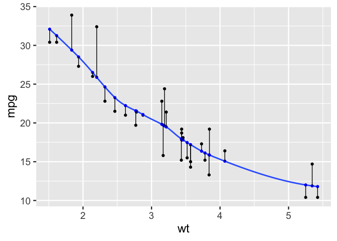
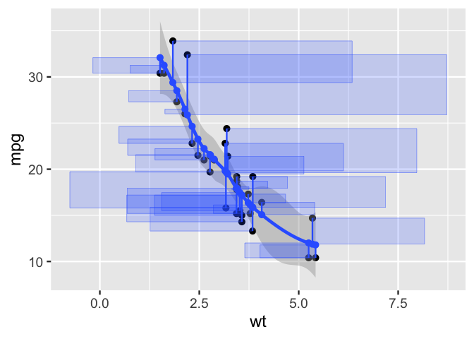
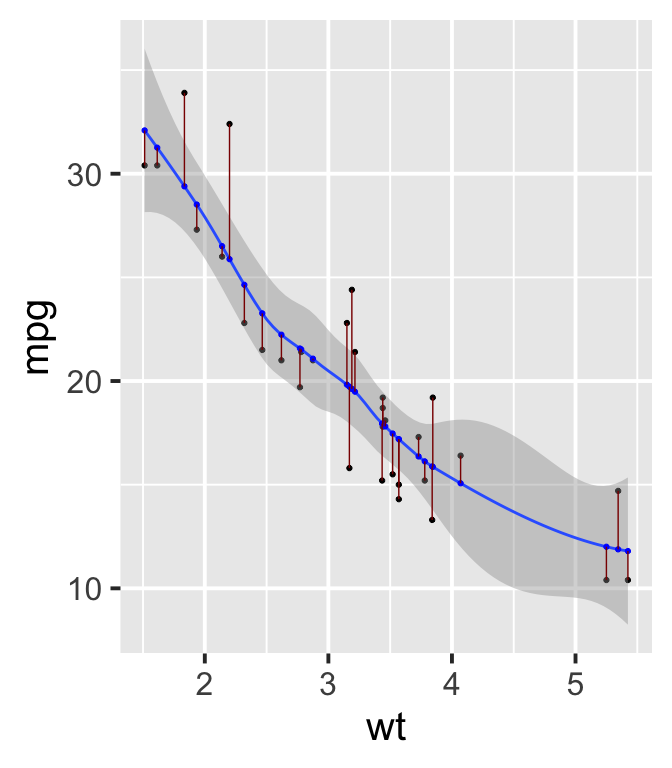
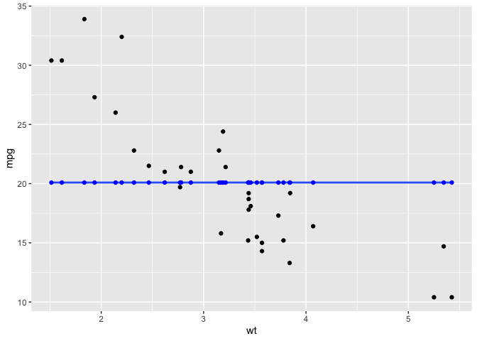

  - [ggsmoothfit](#ggsmoothfit)
  - [Curious about implementation? Details about building these
    functions](#curious-about-implementation-details-about-building-these-functions)
  - [Step 0. Examine ggplot2::StatSmooth$compute\_group, and a dataframe
    that it
    returns](#step-0-examine-ggplot2statsmoothcompute_group-and-a-dataframe-that-it-returns)
  - [Step 1. create
    compute\_group\_smooth\_fit](#step-1-create-compute_group_smooth_fit)
  - [Step 1.1 test compute group](#step-11-test-compute-group)
  - [Step 2. Pass to ggproto](#step-2-pass-to-ggproto)
  - [Step 3. Pass to stat\_\*
    functions](#step-3-pass-to-stat_-functions)
  - [Step 4. Test in ggplot2 pipeline and
    enjoy\!](#step-4-test-in-ggplot2-pipeline-and-enjoy)
      - [Squared residuals](#squared-residuals)
  - [Test with lm](#test-with-lm)
  - [Contrast to an empty model…](#contrast-to-an-empty-model)
  - [Step 4.b Create geom alliases and wrappers, try it out, and enjoy\!
    Wait not working, how do I need to do
    this?](#step-4b-create-geom-alliases-and-wrappers-try-it-out-and-enjoy-wait-not-working-how-do-i-need-to-do-this)
  - [Don’t want to use ggsmoothfit? Here are some ways to get it done
    with base
    ggplot2\!](#dont-want-to-use-ggsmoothfit-here-are-some-ways-to-get-it-done-with-base-ggplot2)
      - [Option 1. Verbal description and move
        on…](#option-1-verbal-description-and-move-on)
      - [Option 2: precalculate and
        plot](#option-2-precalculate-and-plot)
      - [Option 3: little known xseq argument and geom =
        “point”](#option-3-little-known-xseq-argument-and-geom--point)

<!-- README.md is generated from README.Rmd. Please edit that file -->

# ggsmoothfit

<!-- badges: start -->

<!-- badges: end -->

{ggsmoothfit} lets you visualize model fitted values and residuals
easily\!

``` r
library(tidyverse, warn.conflicts = F)
library(ggsmoothfit)
mtcars %>% 
  ggplot() + 
  aes(wt, mpg) +
  geom_point() +
  geom_smooth() +
  ggsmoothfit::stat_fit(color = "blue") + # alias as geom_smooth_fit()
  ggsmoothfit::stat_fit(geom = "segment") # in future, wrap as geom_smooth_error()
#> `geom_smooth()` using method = 'loess' and formula = 'y ~ x'
#> `geom_smooth()` using method = 'loess' and formula = 'y ~ x'
#> `geom_smooth()` using method = 'loess' and formula = 'y ~ x'
```

<!-- -->

# Curious about implementation? Details about building these functions

# Step 0. Examine ggplot2::StatSmooth$compute\_group, and a dataframe that it returns

Key take away: this function allows you to set values of x with the
*xseq argument*. Although the default is to create an evenly spaced
sequence.

``` r
ggplot2::StatSmooth$compute_group
#> <ggproto method>
#>   <Wrapper function>
#>     function (...) 
#> compute_group(...)
#> 
#>   <Inner function (f)>
#>     function (data, scales, method = NULL, formula = NULL, se = TRUE, 
#>     n = 80, span = 0.75, fullrange = FALSE, xseq = NULL, level = 0.95, 
#>     method.args = list(), na.rm = FALSE, flipped_aes = NA) 
#> {
#>     data <- flip_data(data, flipped_aes)
#>     if (length(unique0(data$x)) < 2) {
#>         return(data_frame0())
#>     }
#>     if (is.null(data$weight)) 
#>         data$weight <- 1
#>     if (is.null(xseq)) {
#>         if (is.integer(data$x)) {
#>             if (fullrange) {
#>                 xseq <- scales$x$dimension()
#>             }
#>             else {
#>                 xseq <- sort(unique0(data$x))
#>             }
#>         }
#>         else {
#>             if (fullrange) {
#>                 range <- scales$x$dimension()
#>             }
#>             else {
#>                 range <- range(data$x, na.rm = TRUE)
#>             }
#>             xseq <- seq(range[1], range[2], length.out = n)
#>         }
#>     }
#>     if (identical(method, "loess")) {
#>         method.args$span <- span
#>     }
#>     if (is.character(method)) {
#>         if (identical(method, "gam")) {
#>             method <- mgcv::gam
#>         }
#>         else {
#>             method <- match.fun(method)
#>         }
#>     }
#>     if (identical(method, mgcv::gam) && is.null(method.args$method)) {
#>         method.args$method <- "REML"
#>     }
#>     model <- inject(method(formula, data = data, weights = weight, 
#>         !!!method.args))
#>     prediction <- predictdf(model, xseq, se, level)
#>     prediction$flipped_aes <- flipped_aes
#>     flip_data(prediction, flipped_aes)
#> }

library(dplyr)
mtcars %>%
  rename(x = wt, y = mpg, cat = am) %>%
  ggplot2::StatSmooth$compute_group(method = lm, 
                           formula = y ~ x, n = 7)
#>          x         y      ymin     ymax        se flipped_aes
#> 1 1.513000 29.198941 26.963760 31.43412 1.0944578          NA
#> 2 2.164833 25.715236 24.086350 27.34412 0.7975850          NA
#> 3 2.816667 22.231531 21.040552 23.42251 0.5831635          NA
#> 4 3.468500 18.747827 17.611376 19.88428 0.5564635          NA
#> 5 4.120333 15.264122 13.756629 16.77161 0.7381448          NA
#> 6 4.772167 11.780417  9.692002 13.86883 1.0225936          NA
#> 7 5.424000  8.296712  5.547468 11.04596 1.3461693          NA
```

# Step 1. create compute\_group\_smooth\_fit

Here we’ll piggy back on StatSmooth$compute\_group, to create a
function, compute\_group\_smooth\_fit. We ask that function to compute
predictions at the values of x observed in our data set. We also
preserve the values of y (as yend) so that we can draw in the residual
error.

xend and yend are computed to draw the segments visualizing the error.

``` r
compute_group_smooth_fit <- function(data, scales, method = NULL, formula = NULL,
                           se = TRUE, n = 80, span = 0.75, fullrange = FALSE,
                           level = 0.95, method.args = list(),
                           na.rm = FALSE, flipped_aes = NA){
  
  ggplot2::StatSmooth$compute_group(data = data, scales = scales, 
                       method = method, formula = formula, 
                       se = FALSE, n= n, span = span, fullrange = fullrange,
                       xseq = data$x, 
                       level = .95, method.args = method.args, 
                       na.rm = na.rm, flipped_aes = flipped_aes) %>% 
    dplyr::mutate(xend = data$x,
           yend = data$y
           )
}
```

We’ll also create compute\_group\_smooth\_sq\_error, further
piggybacking, this time on the function we just build. This creates the
ymin, ymax, xmin and xmax columns needed to show the *squared* error.
Initially, I’d included this computation above, but the plot results can
be bad, as the ‘flags’ that come off of the residuals effect the plot
spacing even when they aren’t used. Preferring to avoid this
side-effect, we create two functions (and later two ggproto objects).
Note too that xmax is computed in the units of y, and initial plotting
can yield squares that do not look like squares. Standardizing both
variables, with coord\_equal will get us to squares.

``` r
compute_group_smooth_sq_error <- function(data, scales, method = NULL, formula = NULL,
                           se = TRUE, n = 80, span = 0.75, fullrange = FALSE,
                           level = 0.95, method.args = list(),
                           na.rm = FALSE, flipped_aes = NA){
  
 compute_group_smooth_fit(data = data, scales = scales, 
                       method = method, formula = formula, 
                       se = FALSE, n= n, span = span, fullrange = fullrange,
                       level = .95, method.args = method.args, 
                       na.rm = na.rm, flipped_aes = flipped_aes) %>% 
    dplyr::mutate(ymin = y,
           xmin = x,
           ymax = yend,
           xmax = x + (ymax - ymin))
  
}
```

# Step 1.1 test compute group

``` r
mtcars %>% 
  slice(1:10) %>% 
  rename(x = wt, y = mpg) %>% 
  compute_group_smooth_fit(method = lm, formula = y ~ x)
#>        x        y flipped_aes  xend yend
#> 1  2.620 22.54689          NA 2.620 21.0
#> 2  2.875 21.45416          NA 2.875 21.0
#> 3  2.320 23.83246          NA 2.320 22.8
#> 4  3.215 19.99719          NA 3.215 21.4
#> 5  3.440 19.03301          NA 3.440 18.7
#> 6  3.460 18.94731          NA 3.460 18.1
#> 7  3.570 18.47593          NA 3.570 14.3
#> 8  3.190 20.10432          NA 3.190 24.4
#> 9  3.150 20.27573          NA 3.150 22.8
#> 10 3.440 19.03301          NA 3.440 19.2

mtcars %>% 
  slice(1:10) %>% 
  rename(x = wt, y = mpg) %>% 
  compute_group_smooth_sq_error(method = lm, formula = y ~ x)
#>        x        y flipped_aes  xend yend     ymin  xmin ymax       xmax
#> 1  2.620 22.54689          NA 2.620 21.0 22.54689 2.620 21.0  1.0731060
#> 2  2.875 21.45416          NA 2.875 21.0 21.45416 2.875 21.0  2.4208382
#> 3  2.320 23.83246          NA 2.320 22.8 23.83246 2.320 22.8  1.2875387
#> 4  3.215 19.99719          NA 3.215 21.4 19.99719 3.215 21.4  4.6178145
#> 5  3.440 19.03301          NA 3.440 18.7 19.03301 3.440 18.7  3.1069900
#> 6  3.460 18.94731          NA 3.460 18.1 18.94731 3.460 18.1  2.6126945
#> 7  3.570 18.47593          NA 3.570 14.3 18.47593 3.570 14.3 -0.6059308
#> 8  3.190 20.10432          NA 3.190 24.4 20.10432 3.190 24.4  7.4856839
#> 9  3.150 20.27573          NA 3.150 22.8 20.27573 3.150 22.8  5.6742749
#> 10 3.440 19.03301          NA 3.440 19.2 19.03301 3.440 19.2  3.6069900
```

# Step 2. Pass to ggproto

``` r
StatSmoothFit <- ggplot2::ggproto("StatSmoothFit", ggplot2::Stat,
  setup_params = ggplot2::StatSmooth$setup_params,
  extra_params = c("na.rm", "orientation"),
  compute_group = compute_group_smooth_fit,
  dropped_aes = c("weight"),
  required_aes = c("x", "y")
)

StatSmoothErrorSq <- ggplot2::ggproto("StatSmoothErrorSq", ggplot2::Stat,
  setup_params = ggplot2::StatSmooth$setup_params,
  extra_params = c("na.rm", "orientation"),
  compute_group = compute_group_smooth_sq_error,
  dropped_aes = c("weight"),
  required_aes = c("x", "y")
)
```

# Step 3. Pass to stat\_\* functions

``` r
#' Title
#'
#' @param mapping 
#' @param data 
#' @param geom 
#' @param position 
#' @param ... 
#' @param method 
#' @param formula 
#' @param se 
#' @param n 
#' @param span 
#' @param fullrange 
#' @param level 
#' @param method.args 
#' @param na.rm 
#' @param orientation 
#' @param show.legend 
#' @param inherit.aes 
#'
#' @return
#' @export
#'
#' @examples
stat_fit <- function(mapping = NULL, data = NULL,
            geom = "point", position = "identity",
            ...,
            method = NULL,
            formula = NULL,
            se = TRUE,
            n = 80,
            span = 0.75,
            fullrange = FALSE,
            level = 0.95,
            method.args = list(),
            na.rm = FALSE,
            orientation = NA,
            show.legend = NA,
            inherit.aes = TRUE) {
  ggplot2::layer(
    data = data,
    mapping = mapping,
    stat = StatSmoothFit,
    geom = geom,
    position = position,
    show.legend = show.legend,
    inherit.aes = inherit.aes,
    params = rlang::list2(
      method = method,
      formula = formula,
      se = se,
      n = n,
      fullrange = fullrange,
      level = level,
      na.rm = na.rm,
      orientation = orientation,
      method.args = method.args,
      span = span,
      ...
    )
  )
}
```

``` r
stat_errorsq <- function(mapping = NULL, data = NULL,
                        geom = "rect", position = "identity",
                        ...,
                        method = NULL,
                        formula = NULL,
                        se = TRUE,
                        n = 80,
                        span = 0.75,
                        fullrange = FALSE,
                        level = 0.95,
                        method.args = list(),
                        na.rm = FALSE,
                        orientation = NA,
                        show.legend = NA,
                        inherit.aes = TRUE) {
  ggplot2::layer(
    data = data,
    mapping = mapping,
    stat = StatSmoothErrorSq,
    geom = geom,
    position = position,
    show.legend = show.legend,
    inherit.aes = inherit.aes,
    params = rlang::list2(
      method = method,
      formula = formula,
      se = se,
      n = n,
      fullrange = fullrange,
      level = level,
      na.rm = na.rm,
      orientation = orientation,
      method.args = method.args,
      span = span,
      ...
    )
  )
}
```

# Step 4. Test in ggplot2 pipeline and enjoy\!

``` r
mtcars %>% 
  ggplot() +
  aes(wt, mpg) + 
  geom_point() +
  geom_smooth(alpha = .2, se = FALSE) +
  stat_fit(color = "blue") +  # wrap as geom_smooth_fit()
  stat_fit(geom = "segment") # geom_smooth_error()
#> `geom_smooth()` using method = 'loess' and formula = 'y ~ x'
#> `geom_smooth()` using method = 'loess' and formula = 'y ~ x'
#> `geom_smooth()` using method = 'loess' and formula = 'y ~ x'
```

<!-- -->

## Squared residuals

For best results, use standardized x, y and coord\_equal() as shown
below

``` r
stdz <- function(x){
  
  var_mean <- mean(x) 
  var_sd <- sd(x)
  
  (x-var_mean)/var_sd
  
}

last_plot() + 
  stat_errorsq(geom = "rect", alpha = .1)  + # geom_smooth_error_sq() +
  aes(stdz(wt), stdz(mpg)) + 
  coord_equal()
#> `geom_smooth()` using method = 'loess' and formula = 'y ~ x'
#> `geom_smooth()` using method = 'loess' and formula = 'y ~ x'
#> `geom_smooth()` using method = 'loess' and formula = 'y ~ x'
#> `geom_smooth()` using method = 'loess' and formula = 'y ~ x'
```

<!-- -->

# Test with lm

``` r
mtcars %>% 
  ggplot() +
  aes(wt, mpg) + 
  geom_point() +
  geom_smooth(alpha = .2, se = FALSE, method = lm) + 
  stat_fit(geom = "point", color = "blue", method = lm) + # wrap as geom_smooth_fit()
  stat_fit(geom = "segment", method = lm)
#> `geom_smooth()` using formula = 'y ~ x'
#> `geom_smooth()` using formula = 'y ~ x'
#> `geom_smooth()` using formula = 'y ~ x'
```

<!-- -->

# Contrast to an empty model…

  - show mean of y, residuals and squares (variance)

<!-- end list -->

``` r
mtcars %>% 
  ggplot() +
  aes(stdz(wt), stdz(mpg)) + 
  geom_point() +
  geom_smooth(alpha = .2, se = FALSE, method = lm,  formula = y ~ 1) + 
  stat_fit(geom = "point", color = "blue", method = lm, formula = y ~ 1) + # wrap as geom_smooth_fit()
  stat_fit(geom = "segment", method = lm, formula = y ~ 1) + 
  stat_errorsq(geom = "rect", alpha = .1, method = lm, formula = y ~ 1) + 
  coord_equal()
```

<!-- -->

# Step 4.b Create geom alliases and wrappers, try it out, and enjoy\! Wait not working, how do I need to do this?

``` r
geom_smooth_fit <- function(...){stat_fit(color = "blue",...)}   # wrap as geom_smooth_fit()

geom_smooth_residual <- function(...){stat_fit(geom = "segment", color = "darkred", ...)}   # wrap as geom_smooth_fit()

mtcars %>%
  ggplot() +
  aes(wt, mpg) +
  geom_point() +
  geom_smooth(alpha = .2, se = FALSE) +
  geom_smooth_fit(color = "blue") #+  # wrap as geom_smooth_fit()
  geom_smooth_residual(geom = "segment")
```

# Don’t want to use ggsmoothfit? Here are some ways to get it done with base ggplot2\!

## Option 1. Verbal description and move on…

“image a line that drops down from the observation to the model line”
use vanilla geom\_smooth

``` r
mtcars %>% 
  ggplot() +
  aes(wt, mpg) + 
  geom_point() + 
  geom_smooth()
#> `geom_smooth()` using method = 'loess' and formula = 'y ~ x'
```

<!-- -->

## Option 2: precalculate and plot

\[stack overflow example goes here.\]

## Option 3: little known xseq argument and geom = “point”

First a bit of under-the-hood thinking about geom\_smooth/stat\_smooth.

``` r
mtcars %>% 
  ggplot() +
  aes(wt, mpg) + 
  geom_smooth(n = 12) +
  stat_smooth(geom = "point", 
              color = "blue", 
              n = 12)
#> `geom_smooth()` using method = 'loess' and formula = 'y ~ x'
#> `geom_smooth()` using method = 'loess' and formula = 'y ~ x'
```

<!-- -->

Specify xseq… Almost surely new to you (and probably more interesting to
stats instructors): predicting at observed values of x.. Warning, this
is off label..

xseq is not advertised, but possibly of interest..
<https://ggplot2.tidyverse.org/reference/geom_smooth.html>

``` r
# fit where the support is in the data... 
mtcars %>% 
  ggplot() +
  aes(wt, mpg) + 
  geom_point() +
  geom_smooth() + 
  stat_smooth(geom = "point", 
              color = "blue", 
              xseq = mtcars$wt)
#> `geom_smooth()` using method = 'loess' and formula = 'y ~ x'
#> `geom_smooth()` using method = 'loess' and formula = 'y ~ x'
```

<!-- -->

``` r


mtcars %>%
  ggplot() +
  aes(x = wt, y = mpg) +
  geom_point() +
  geom_smooth() +
  stat_smooth(geom = "segment",
              color = "darkred",
              xseq = mtcars$wt,
              xend = mtcars$wt,
              yend = mtcars$mpg
  )
#> `geom_smooth()` using method = 'loess' and formula = 'y ~ x'
#> `geom_smooth()` using method = 'loess' and formula = 'y ~ x'
```

<!-- -->

``` r

mtcars %>% 
  ggplot() +
  aes(wt, mpg) + 
  geom_point() +
  geom_smooth(formula = y ~ 1, 
              method = lm, 
              se = F) +
  stat_smooth(geom = "point", 
              color = "blue", 
              xseq = mtcars$wt, 
              method = lm, 
              formula = y ~1)
```

<!-- -->
